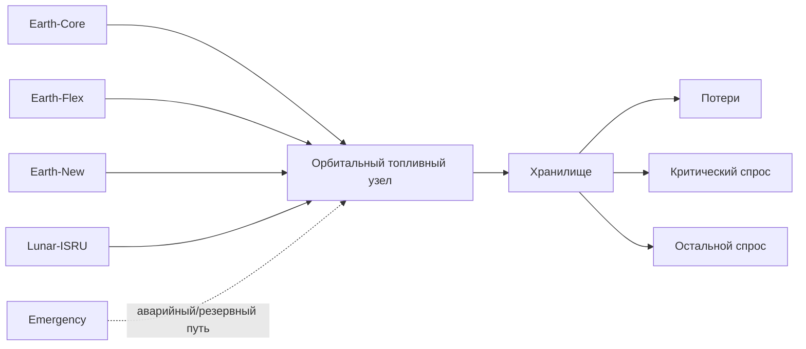
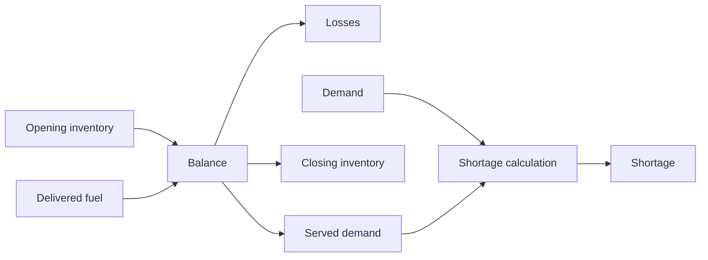
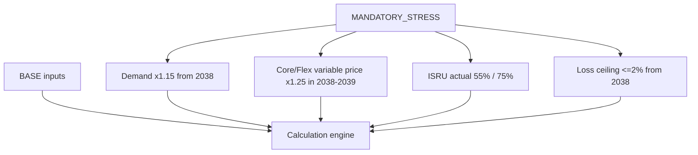
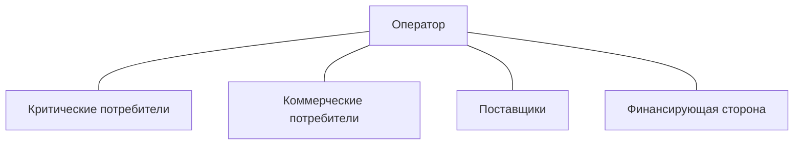

# «Топливный космоконтур 2035»: планировщик и оптимизатор

В репозитории реализовано приложение участника: русскоязычный интерфейс Streamlit, ежедневный материальный баланс, минимизация стоимости BASE, сценарии, риски и экспорт JSON/CSV/XLSX. Ниже сохранена исходная постановка организатора.

## Запуск приложения

```bash
python3 -m venv .venv
.venv/bin/python -m pip install -r requirements.lock
.venv/bin/streamlit run app.py
```

Откройте адрес, показанный Streamlit. Выберите пример плана и нажмите «Рассчитать». Сценарий меняется в боковой панели; после изменений нужен новый расчет. Оптимизатор находится на вкладке «Оптимизация».

```bash
.venv/bin/python -m pytest -q
.venv/bin/python tools/validate_reference_repo.py --participant
.venv/bin/python -m fuel_planner.cli compare examples/plans/earth.json
```

[Руководство, архитектура и допущения](docs/APPLICATION.md) · [Результаты примеров](results/README.md)

Комплект включает [управленческую записку](docs/MANAGEMENT_REPORT.md) ([10-страничная версия для печати](docs/MANAGEMENT_REPORT.html)), [одностраничное сравнение сценариев](docs/SCENARIO_SUMMARY.md) ([версия для печати](docs/SCENARIO_SUMMARY.html)), [проверку каждого критерия](docs/CRITERIA_AUDIT.md), количественный анализ стейкхолдеров и меры реагирования с бюджетом. Примеры — рассчитанные решения при явно указанных допущениях, а не рекомендация организатора. Исходные условия и сценарии сохранены.

Доказательные материалы перестраиваются командой `.venv/bin/python tools/audit_submission.py`. Выбранный план — `examples/selected_plan.json`; подробные годовые проверки — `results/annual-constraints.csv`. Редактор входных данных сохраняет исследовательскую копию вместе с планом.

---

# Исходная постановка кейса

**Горизонт:** 2035–2040.  
**Предмет:** планирование снабжения условного орбитального топливного узла криогенными компонентами для цислунарной транспортной системы.

Команда должна разработать **работающий цифровой инструмент**, в котором оператор может менять допустимые решения по закупкам, резервированию мощности, физическому запасу, контрактам и инвестициям, а затем получать пересчитанные материальный баланс, стоимость, уровень обслуживания, нарушения ограничений и результаты стресс-тестов.

Этот GitHub-репозиторий содержит **контрольные правила, форматы обмена, синтетические тест-векторы, научную базу и порядок проверки**. Репозиторий не определяет за команду объёмы закупки топлива, момент инвестиций, метод оптимизации, программный стек или интерфейс.

> **Ключевой принцип:** в цислунарной логистике не бывает фразы "дошлем следующим рейсом".

Если две команды используют разные архитектуры и приходят к разным планам, это допустимо. Их расчёты должны исходить из одной контрольной базы, явно отделять собственные допущения от условий организатора и воспроизводимо показывать последствия решений.

---

## Содержание

1. [Что нужно сделать](#1-что-нужно-сделать)
2. [Что сдаёт команда](#2-что-сдаёт-команда)
3. [Что считается цифровым контуром](#3-что-считается-цифровым-контуром)
4. [CASE_INPUT, TEAM_DECISION и TEAM_ASSUMPTION](#4-case_input-team_decision-и-team_assumption)
5. [Граница модели](#5-граница-модели)
6. [Исходные данные](#6-исходные-данные)
7. [Спрос](#7-спрос)
8. [Каналы снабжения](#8-каналы-снабжения)
9. [Хранилище и инвестиционные опции](#9-хранилище-и-инвестиционные-опции)
10. [Reserved, ordered, delivered и served](#10-reserved-ordered-delivered-и-served)
11. [Материальный баланс](#11-материальный-баланс)
12. [Временной шаг и lead time](#12-временной-шаг-и-lead-time)
13. [Потери и хранение](#13-потери-и-хранение)
14. [45-дневный резерв](#14-45-дневный-резерв)
15. [Контракты и take-or-pay](#15-контракты-и-take-or-pay)
16. [Инвестиции и ввод мощности](#16-инвестиции-и-ввод-мощности)
17. [Финансовый расчёт](#17-финансовый-расчёт)
18. [Уровень обслуживания](#18-уровень-обслуживания)
19. [Надёжность](#19-надёжность)
20. [BASE и MANDATORY_STRESS](#20-base-и-mandatory_stress)
21. [Sensitivity, risk scenarios и Monte Carlo](#21-sensitivity-risk-scenarios-и-monte-carlo)
22. [Реестр рисков](#22-реестр-рисков)
23. [Стейкхолдеры и MCDA](#23-стейкхолдеры-и-mcda)
24. [Контракт расчётного ядра](#24-контракт-расчётного-ядра)
25. [Сохранение и экспорт](#25-сохранение-и-экспорт)
26. [Ошибки и нарушения](#26-ошибки-и-нарушения)
27. [Контрольные тесты](#27-контрольные-тесты)
28. [Расширяемость](#28-расширяемость)
29. [Схемы и графики](#29-схемы-и-графики)
30. [Карта критериев](#30-карта-критериев)
31. [Геополитический бонусный модуль](#31-геополитический-бонусный-модуль)
32. [Структура репозитория команды](#32-структура-репозитория-команды)
33. [Список литературы](#33-список-литературы)
34. [Глоссарий](#34-глоссарий)

---

## 1. Что нужно сделать

Задача — не нарисовать статичный dashboard и не написать отчёт, а связать управленческие решения с пересчитываемой моделью.


Минимальный рабочий сценарий пользователя:

1. загрузить или выбрать контрольный набор;
2. сформировать собственный план;
3. проверить исполнимость;
4. рассчитать поставки, запас, дефицит, service level и стоимость;
5. переключить BASE на MANDATORY_STRESS;
6. сравнить последствия;
7. исследовать sensitivity и собственные риски;
8. сохранить план;
9. повторно открыть его;
10. выгрузить машиночитаемый результат.

Автоматический optimizer **не обязателен**. Интерактивный scenario planner без optimizer допустим, если расчёт воспроизводим и ограничения проверяются реально.

---

## 2. Что сдаёт команда

Постановка требует связанного комплекта материалов.

**Управленческая записка:** ориентир 8–12 страниц плюс одностраничное сравнение сценариев. В ней раскрываются архитектура расчёта и снабжения, данные, допущения, сравнение стратегий, контракты, инвестиции, экономика, stress methodology, рассчитанные риски, интересы стейкхолдеров, бюджет и roadmap.

**Работающий цифровой контур:** эксперт должен самостоятельно изменить разрешённое решение и увидеть новый расчёт. Статическая таблица с заранее записанными итогами этого требования не закрывает.

**Исходный код, данные и конфигурации:** всё, что требуется для повторного запуска. Если часть системы внешняя, README команды объясняет доступ, версии и команду запуска.

**Презентация:** до 12 слайдов с пользовательским сценарием, решениями, альтернативами, ключевыми числами, ограничениями и BASE/STRESS.

**Проверяемые расчёты:** BASE, mandatory stress, low/high demand checks, собственные риски и демонстрация перспективного периода на копии набора.

**Риски, stakeholders и export:** рассчитанный risk register, stakeholder map и выгрузка результатов в CSV или XLSX. Числа в export, интерфейсе и записке должны совпадать.

---

## 3. Что считается цифровым контуром

В кейсе нет требования к конкретному виду продукта. Web application, desktop tool, dashboard, API + frontend, notebook-based interface, чат-бот поверх расчётного ядра или другой программный формат допустимы, если обеспечивают проверяемое поведение.

```text
inputs
  -> decisions
  -> calculation
  -> validation
  -> scenario comparison
  -> save
  -> reopen
  -> export
```

Важно различать **интерфейс** и **расчётное ядро**. Красивый UI с заранее записанными цифрами не заменяет модель. И наоборот, корректная модель должна иметь достаточно понятный пользовательский путь для экспертной проверки.

Excel допустим для подготовки данных, независимой проверки и выгрузки, но не заменяет программный контур как единственную статическую таблицу.

---

## 4. CASE_INPUT, TEAM_DECISION и TEAM_ASSUMPTION

Любой параметр рекомендуется относить к одной из трёх категорий.

### `CASE_INPUT`

То, что дано организатором и образует контрольную базу: спрос, мощности, цены, lead time, reliability metadata, лимиты CAPEX, service thresholds, обязательный stress.

### `TEAM_DECISION`

То, что выбирает команда или оператор внутри своего плана: reserved capacity, order volume, физический reserve, инвестиционные действия, сравниваемые альтернативы.

### `TEAM_ASSUMPTION`

Дополнительная гипотеза, которой нет в исходнике: discount rate, вероятность собственного риска, конкретная конвенция `month -> day`, спрос 2041, дополнительный research-contract penalty.

`TEAM_ASSUMPTION` допустим. Недопустимо выдавать его за `CASE_INPUT`.

Подробная граница: [`docs/CASE_RULES.md`](docs/CASE_RULES.md).

---

## 5. Граница модели

Контрольная модель агрегирована. Все источники поставляют сопоставимый условный топливный ресурс в один орбитальный узел. Variable source price уже включает доставку в узел в рамках учебного набора.

Обязательная часть не требует детальной trajectory optimization, выбора конкретной ракеты, CFD, геометрии баков или телеметрии. Команда может добавить higher-fidelity module как исследование, но он не заменяет контрольный материал.



Схема не предписывает, какие каналы команда должна выбрать.

---

## 6. Исходные данные

Машиночитаемая контрольная база находится в [`data/`](data/README.md).

| Файл | Содержание |
|---|---|
| [`data/demand.csv`](data/demand.csv) | спрос 2035–2040 |
| [`data/supply_sources.csv`](data/supply_sources.csv) | пять каналов снабжения |
| [`data/storage_options.csv`](data/storage_options.csv) | storage modes |
| [`data/investment_options.csv`](data/investment_options.csv) | investment options |
| [`data/constraints.csv`](data/constraints.csv) | hard checks |

Денежные значения выражаются в **млн условных денежных единиц в постоянных ценах 2035 года**.

Словарь полей: [`docs/DATA_DICTIONARY.md`](docs/DATA_DICTIONARY.md).  

---

## 7. Спрос

Критический спрос **входит** в общий.

| Год | Базовый общий | Базовый критический | Низкий общий | Высокий общий |
|---:|---:|---:|---:|---:|
| 2035 | 100 | 80 | 80 | 110 |
| 2036 | 140 | 105 | 112 | 154 |
| 2037 | 190 | 135 | 152 | 209 |
| 2038 | 250 | 170 | 200 | 312.5 |
| 2039 | 320 | 210 | 256 | 400 |
| 2040 | 390 | 250 | 312 | 487.5 |

Единица — т/год.

Неверно:

```text
modeled_total = base_total + base_critical
```

Правильно: `base_critical` — подмножество `base_total`.

Для low/high checks доля critical demand сохраняется от соответствующего базового года.

---

## 8. Каналы снабжения

| ID | Канал | Capacity, т/год | Variable cost, млн/т | Reservation rate | TOP | Lead time | Reliability input |
|---|---|---:|---:|---:|---:|---|---|
| A | Earth-Core | 190 | 6.2 | 0.45 | 70% | 12 месяцев | 0.96 |
| B | Earth-Flex | 110 | 8.9 | 0.15 | 0% | 4 месяца | 0.985 |
| C | Earth-New | 130 | 7.1 | 0.30 | 50% после ввода | 18–24 месяца | 0.88 первый год, 0.94 далее |
| D | Lunar-ISRU | 120 | 3.0 | 0 | 0 | 1–2 месяца после ввода | 0.78 / 0.90 / 0.93 в 2038–2040 |
| E | Emergency | 80 | 13.8 | 0.35 | 0 | **6 недель** | 0.995 |

`capacity` не равна заказу, поставке или inventory. Reliability не является автоматическим BASE multiplier.

Для Earth-New фиксированный `available_from_year` не задан: доступность зависит от решения команды и lead time. Для Emergency исходная единица сохраняется как **week**, а не скрыто переводится в 1.5 month.

---

## 9. Хранилище и инвестиционные опции

### Storage

| Режим | Capacity | Loss rate on throughput | Holding cost | CAPEX | Additional OPEX |
|---|---:|---:|---:|---:|---:|
| Base storage | 70 т | 4.5% | 0.72 млн у.е./т-год | 0 | 0 |
| ZBO modernization | 120 т | 1.2% | 0.72 млн у.е./т-год | 180 | 12/год |

ZBO доступна как опция с 2036 года. **1.2% — модельный коэффициент кейса, а не универсальная заявленная характеристика реальной ZBO-технологии.**

### Investments

- Lunar-ISRU pilot: CAPEX 1250; профинансировать до 2038; ввод с 2038; fixed OPEX +70/год.
- Earth-New option: 90 за право + 270 при реализации = **360 total**.
- ZBO modernization: CAPEX 180.

Starter kit объясняет учёт, но не рекомендует, какую опцию выбирать.

---

## 10. Reserved, ordered, delivered и served


```text
reserved != ordered != delivered != served
capacity != inventory
contractual emergency reserve != physical stock
```

`reserved_capacity` — право/договорная мощность. `ordered_volume` — решение об отборе. `delivered_volume` — физически поступившее топливо с учётом сценария. `served_demand` — реально выданный потребителям объём.

Смешивание этих сущностей почти неизбежно приводит к двойному счёту.

---

## 11. Материальный баланс

Контрольное правило:

```text
I_end = I_start + Q_delivered - Losses - Q_served
```

где все величины относятся к одному временному периоду.

Дефицит считается отдельно:

```text
Shortage = max(0, Demand - Q_served)
```

**Отрицательный inventory не является физическим запасом.** Если ресурсов недостаточно, physical stock не уходит ниже нуля. Shortage показывается отдельной метрикой.



Формулы и unit checks: [`docs/CALCULATION_RULES.md`](docs/CALCULATION_RULES.md).

---

## 12. Временной шаг и lead time

Команда свободно выбирает timestep: event-based, daily, weekly, monthly или другой. Но выбранная дискретизация должна выявлять **внутригодовой shortage и storage overflow**, а не только сравнивать годовые суммы.

В контрольной постановке для перевода дней в объём используется равномерный спрос и 365 дней в учебном году.

Модель должна сохранять различия:

- Emergency — 6 недель;
- Earth-Flex — 4 месяца;
- Earth-Core — 12 месяцев;
- Earth-New — 18–24 месяца;
- Lunar-ISRU после ввода — 1–2 месяца.

Если реализация переводит month/week в days, метод conversion раскрывается как implementation assumption.

---

## 13. Потери и хранение

В контрольной модели:

```text
Throughput = gross inflow during period
Losses = Throughput * loss_rate
```

Потери начисляются **один раз** на валовое поступление. Нельзя после этого тем же коэффициентом повторно уменьшать тот же физический объём через closing inventory.

Holding cost рассчитывается от **среднего физического запаса с учётом времени**, а не от годового спроса.

При смене режима хранения внутри года inflow относится к фактически действующему режиму соответствующего периода.

---

## 14. 45-дневный резерв

Контрольная формула:

```text
R_y = D_y * 45 / 365
```

`D_y` — общий спрос соответствующего сценария и года.

Физический вариант проверяется на начало года. Контрактный Emergency может считаться эквивалентом только если показано, что договорный объём и timing реально закрывают период до прибытия поставки.

Годовая мощность Emergency 80 т/год **сама по себе не означает**, что 80 т находятся в узле или могут прибыть немедленно. Нужно учитывать 6 недель общего времени выполнения заказа (6-week lead time).

Начальный inventory также не бесплатен: команда показывает источник, дату доставки и финансирование. Нельзя одновременно внести один и тот же объём как opening stock и как новое поступление.

---

## 15. Контракты и take-or-pay

Для договорного периода:

```text
Q_pay = max(Q_order, take_or_pay_share * Q_reserved_period)
VariablePayment = price * Q_pay
```

Плата за reservation считается отдельно:

```text
ReservationPayment = reservation_rate * annual_reserved_capacity * period_fraction
```

Take-or-pay уже учтён внутри `max(...)`. Добавлять тот же минимум вторым платежом нельзя.

Для частичного года reservation prorate делается по доле года. Более мелкий timestep не должен создавать независимые месячные TOP minimum поверх годового обязательства, если команда не определила отдельный research contract.

Синтетические примеры: V03–V05 в [`validation/control_cases.md`](validation/control_cases.md).

---

## 16. Инвестиции и ввод мощности

Общая логика:


Особенно важная контрольная трактовка Earth-New:

```text
90 + 270 = 360
```

`360` — total, а не третий платёж поверх 90 и 270.

Момент реализации опции — решение команды. Репозиторий не публикует «правильную» дату.

---

## 17. Финансовый расчёт

Минимальное разложение:

```text
TotalCost = Procurement + Reservation + Holding + FixedOPEX + CAPEX
```

Не дублируйте стоимость потерь поверх уже оплаченного восполняющего топлива без отдельного экономического механизма.

Если команда использует дисконтирование:

```text
PV_t = CF_t / (1 + r)^(t - t0)
```

Ставка `r`, real/nominal interpretation и `t0` раскрываются. Если организатор не задаёт rate, это `TEAM_ASSUMPTION`. Внутри сравнения альтернатив команды ставка должна оставаться одной и той же.

В исходнике нет выручки и стоимости срыва миссии. Эти величины нельзя тихо добавлять как organiser facts.

---

## 18. Уровень обслуживания

```text
SL_total = served_total / demand_total
SL_critical = served_critical / demand_critical
```

BASE minimums:

```text
SL_total >= 0.97
SL_critical >= 0.99
```

Проверка проводится ежегодно. Критический спрос уже входит в общий, поэтому critical volume нельзя прибавлять к total второй раз.

В mandatory stress эти уровни используются как ориентиры устойчивости: если план их не достигает, система показывает нарушение/дефицит и причину, а не увеличивает budget/capacity задним числом.

---

## 19. Надёжность

Контрольный BASE детерминирован.

Неверно для BASE:

```text
delivered = planned * reliability
```

Правило: своевременно заказанные доступные плановые объёмы поступают по плану; reliability рассматривается в отдельном risk block с явно выбранным математическим смыслом.

Это особенно важно для mandatory stress: заданные фактические Lunar-ISRU shares 55% и 75% **не умножаются повторно на reliability**.

Если команда хочет построить отдельную вероятностную модель, она должна объяснить, что именно означает reliability: probability of availability, event probability, expected fraction или другое. Starter kit не навязывает интерпретацию, которой нет в исходнике.

---

## 20. BASE и MANDATORY_STRESS

`BASE` и `MANDATORY_STRESS` известны с начала кейса и хранятся отдельно в [`scenarios/`](scenarios/README.md).

| Параметр | 2035–2037 | 2038 | 2039 | 2040 |
|---|---:|---:|---:|---:|
| Base total demand | 100% | 115% | 115% | 115% |
| Base critical demand | 100% | 115% | 115% | 115% |
| Earth-Core variable price | 100% | 125% | 125% | 100% |
| Earth-Flex variable price | 100% | 125% | 125% | 100% |
| Lunar-ISRU actual delivery | plan | 55% plan | 75% plan | plan |
| Stress loss ceiling | n/a | <=2% | <=2% | <=2% |

Резервные тарифы, CAPEX и прочие цены обязательным +25% price shock не меняются.



Mandatory stress не объединяется автоматически с high demand или geopolitical scenario. Комбинация — отдельный `TEAM_*` research scenario.

Подробный protocol: [`docs/STRESS_PROTOCOL.md`](docs/STRESS_PROTOCOL.md).

---

## 21. Sensitivity, risk scenarios и Monte Carlo

Различайте методы:

- **mandatory stress** — фиксированный тест организатора;
- **sensitivity analysis** — изменение параметра в диапазоне и поиск threshold;
- **team-defined risk scenario** — собственное событие с явным mapping на input;
- **reverse stress** — поиск условий, при которых план перестаёт выполнять constraint;
- **robust analysis** — работа на явно заданном uncertainty set и оценка price of protection;
- **Monte Carlo** — вероятностная процедура только при обоснованных distributions/dependencies.

Для Monte Carlo раскрываются distributions, dependence, number of runs, seed и точность. Десять придуманных сценариев не доказывают реальную вероятность 10%.

Сложный алгоритм сам по себе не даёт преимущества над простой проверяемой моделью.

---

## 22. Реестр рисков

Для существенного риска удобно хранить:

```text
risk_id
event
cause
affected_parameter
period
probability_basis_or_range
physical_consequence
financial_consequence
service_consequence
dependencies
owner
mitigation
residual_consequence
```

Risk register должен быть связан с расчётным контуром: изменение риска меняет конкретный input/scenario и приводит к измеримому consequence.

Качественная шкала допустима для трудно формализуемых факторов, но `3 x 4` по ordinal шкалам не становится автоматически денежным ущербом.

---

## 23. Стейкхолдеры и MCDA

Минимально рассмотреть:

- оператора узла;
- критических потребителей;
- коммерческих/прочих потребителей;
- поставщиков запуска/топлива;
- инвестора или финансирующую сторону.



Если используется MCDA, команда раскрывает criteria, normalization, weights, происхождение weights и sensitivity. Starter kit **не задаёт готовые веса**.

Изменение веса пострадавшей стороны не устраняет физический shortage и не отменяет service constraint.

---

## 24. Контракт расчётного ядра

Ниже не код, а удобное языконезависимое разбиение ответственности:

```text
load_case()
validate_case()
load_plan()
validate_plan()
apply_scenario()
calculate_deliveries()
calculate_inventory()
calculate_service()
calculate_costs()
check_constraints()
evaluate_risks()
compare_scenarios()
save_plan()
load_saved_plan()
export_results()
```

Названия функций не обязательны. Важно, чтобы поведение было проверяемым и одни и те же calculation paths использовались интерфейсом и export.

Portable schemas находятся в [`schemas/`](schemas/plan.schema.json). `plan.schema.json` намеренно не содержит готовых competition decisions.

---

## 25. Сохранение и экспорт

Пользователь должен иметь возможность сохранить и повторно открыть plan. Минимально полезный export envelope содержит:

```text
scenario_id
plan_id
units
assumptions_reference
yearly_balance
source_schedule
inventory_trace
financial_breakdown
constraint_checks
risk_register
```

Пример структуры: [`examples/example_export_structure.csv`](examples/example_export_structure.csv). Значения в примере синтетические.

Export должен позволять понять scenario, периоды, units и assumptions. Числа должны совпадать с UI.

---

## 26. Ошибки и нарушения

Неисполнимый plan не нужно автоматически «чинить». Его нужно корректно диагностировать.

Хороший формат:

```text
CAPACITY_EXCEEDED
source=Source-X
year=2038
reserved=12
maximum=10
excess=2
```

Плохой формат:

```text
Error 400
```

Нарушение должно содержать rule/constraint ID, period и фактическое значение.

---

## 27. Контрольные тесты

Каталог [`validation/`](validation/README.md) содержит синтетические test vectors V01–V10:

- material balance;
- shortage vs negative inventory;
- take-or-pay;
- no double TOP;
- reservation proration;
- losses once on throughput;
- 45-day reserve;
- capacity violation;
- critical-demand nesting;
- no double reliability in stress-delivery pattern.

Пример V01:

```text
opening_inventory = 10
delivered = 30
losses = 2
served = 25
closing_inventory = 13
```

Эти тесты проверяют арифметику, а не качество competition strategy. Прохождение V01–V10 не означает, что выбран хороший source mix.

Значения: [`validation/expected_checks.json`](validation/expected_checks.json).

---

## 28. Расширяемость

### Добавление источника

На **копии** набора добавьте синтетический `Source-X` и покажите, что система подхватывает новую строку через data/configuration, а не требует переписывать формулу специально под шестой источник.

### Добавление будущего периода

На копии добавьте 2041 год с явными `TEAM_ASSUMPTION` для demand, prices, availability, reliability interpretation и applicable constraints.

2041 год **может быть использован для проверки модели**, но не обязателен. 

---

## 29. Схемы и графики

Участнический UI может быть любым, но полезно визуально отделять физику, деньги и ограничения. Типовые графики:

- supply by source;
- demand vs served demand;
- inventory trace;
- reserve threshold;
- annual expenditure breakdown;
- CAPEX timeline;
- service level;
- BASE vs stress deltas;
- sensitivity threshold/tornado;
- risk impacts.

В starter repository есть **только синтетические** примеры формы графиков:


Они не используют competition data и не показывают «правильный» план. Описание: [`docs/figures/README.md`](docs/figures/README.md).

---

## 30. Карта критериев

| Критерий | Баллы | Проверяемый предмет |
|---|---:|---|
| Надёжность и корректность модели | 25 | formulas, units, timing, capacity, storage, service, reserve, payments, tests |
| Архитектура расчёта и обоснование стратегии | 20 | decision logic, alternatives, contracts, investments, assumptions |
| Стресс тестирование | 20 | mandatory stress, sensitivity, own risks, thresholds |
| Оценка рисков | 15 | quantified consequences, basis, dependencies, owners, mitigation |
| Интересы заинтересованных сторон | 10 | interests, metrics, contracts, change under risk |
| Функциональность цифрового контура | 10 | change/recalculate/save/reopen/export/extend |


Основная шкала — 100

Сложность стека, наличие optimizer и сам факт использования Lunar-ISRU не являются самостоятельными баллами.

---

## 31. Геополитический бонусный модуль

Это **отдельный research scenario**, а не часть mandatory stress. Starter kit не задаёт политические события и не придумывает probabilities.

Минимальный interface может хранить:

```text
event_label
affected_source_or_cost_component
start_period
end_period
multiplier_or_range
source_or_TEAM_ASSUMPTION
```

Нужно показать причинную цепочку `event -> affected parameter -> recalculation -> cost/supply/stakeholder effect`, export параметров и возможность восстановить control values.

Если точная probability не имеет данных, используйте scenario/range вместо ложной точности.

---


## 32. Структура репозитория команды

Организатор не требует точного дерева. Примерный вариант:

```text
participant-solution/
├── README.md
├── src/
├── data/
├── configs/
├── tests/
├── results/
├── presentation/
└── docs/
```

README команды должен объяснять, где находятся calculation engine, inputs, scenarios, saved plans, tests, exports и docs.

**Изначальный starter repository `test_oil` не содержал приложения и готового плана.** В текущей реализации расчетное ядро и optimizer находятся в `fuel_planner/`, интерфейс — в `app.py`, а рассчитанные планы — в `examples/plans/`.

---

## 33. Список литературы

Правило научной трассируемости:

```text
source
  -> supported proposition/method
  -> use in model/framework
  -> limitation
```

В framework используются, в частности:

- NASA-STD-7009B — credibility, verification/validation, uncertainty/sensitivity;
- Koki Ho (2024) — space logistics, inventory and infrastructure modeling;
- Simonini et al. (2024) — cryogenic propellant management;
- Sommariva et al. (2023) — Earth-vs-lunar orbital-depot economic comparison under uncertainty;
- Bertsimas & Sim (2004) — robust optimization as optional method;
- Linkov et al. (2006) — MCDA and adaptive management;
- JCGM 101:2008 — Monte Carlo propagation procedure as methodological reference;
- Han et al. (2023) — dual sourcing under disruption;
- Guo et al. (2025) — supply-chain resilience, inventory, multiple sourcing and reservation;
- Kenny et al. / Perrin (2025) — ISCPT engineering context.

Подробная библиография: [`docs/SCIENTIFIC_BASIS.md`](docs/SCIENTIFIC_BASIS.md).  

Внешняя статья не заменяет `CASE_INPUT`: например, cryogenic paper не используется для объявления case-model ZBO loss 1.2% реальным universal benchmark.

---

## 34. Глоссарий

**КРТ** — компоненты ракетного топлива; в учебной модели объёмы агрегированы в тоннах.

**ISRU** — (с англ. in-situ resource utilization) концепция и комплекс технологий, предназначенных для добычи и переработки местных ресурсов на других планетах. 

**ZBO** — (с англ. zero boil-off) нулевой уровень потерь от испарения.

**CAPEX** — капитальные вложения.

**OPEX** — эксплуатационные расходы.

**Take-or-pay** — обязанность оплатить минимум договора даже при меньшем отборе.

**Capacity reservation** — отдельная плата за доступность зарезервированной мощности.

**Lead time** — срок от решения/заказа до доступности мощности или поставки.

**Throughput** — валовое поступление, используемое как база model storage loss.

**NPV / discounted cost** — приведённая стоимость денежных потоков; в кейсе без заданной выручки сравниваются расходы.

**MCDA** — (с англ. multi-criteria decision analysis) многокритериальный анализ принятия решений. При использовании MCDA раскрываются criteria, normalization и weights.

**Robust analysis** — анализ на заданном uncertainty set с оценкой trade-off между nominal performance и protection.

---

## Навигация по starter repository

```text
data/        CASE_INPUT в машиночитаемом виде
scenarios/   BASE и MANDATORY_STRESS
schemas/     переносимые contracts данных/плана/export
examples/    пустой plan и synthetic invalid examples
validation/  arithmetic test vectors
docs/        rules, sources, FAQ
tools/       static integrity checks
```

Начните с [`data/README.md`](data/README.md), затем прочитайте [`docs/CASE_RULES.md`](docs/CASE_RULES.md) и [`docs/CALCULATION_RULES.md`](docs/CALCULATION_RULES.md). После реализации прогоните [`validation/control_cases.md`](validation/control_cases.md) и собственные integration tests.


GitHub Actions запускает ту же проверку на push и pull request.
